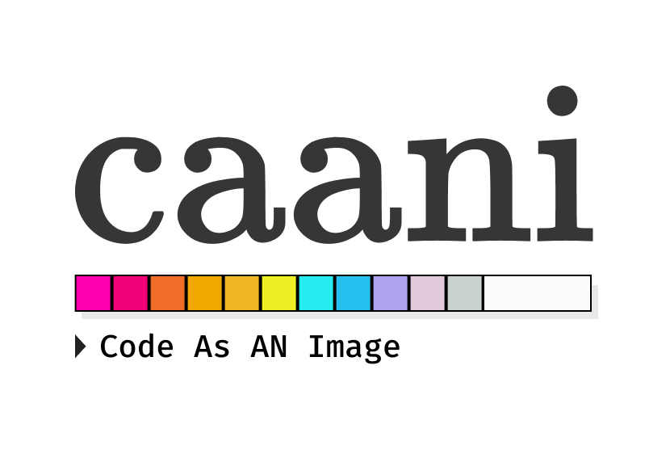
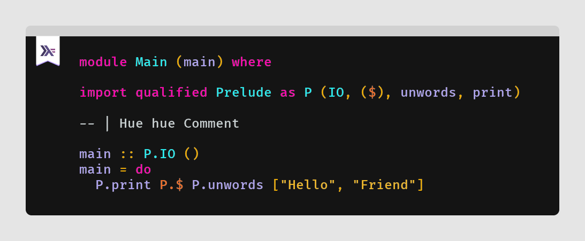

<div align="center">
  

</div>

## :warning: Work in Progress

**A Library and CLI made in Haskell** (It's a project for fun and learn a lot)

Take a haskell code and generate an image.

You can test a telegram bot, which uses this library: https://t.me/PepeHsBot

##### Example with the CLI

file: `samples/code.hs`

```
module Main (main) where

import qualified Prelude as P (IO, ($), unwords, print)

-- | Hue hue Comment

main :: P.IO ()
main = do
  P.print P.$ P.unwords ["Hello", "Friend"]
```

```sh
$ cat samples/code.hs | ./result/bin/caani -o docs/code.png

   Yay!!! The image was saved in 'docs/code.png'

```

<div align="center">
  

  samples/code.png
</div>

## Releases

It's needed to test the released binaries available [here](https://github.com/jeovazero/caani/releases). :see_no_evil:

## Building

With the [Nix](https://nixos.org/) installed:

```sh
$ make build
$ ./result/bin/caani -h
```

> I don't use Stack yet :(

## Roadmap

#### Features

- [ ] Add numbers in the lines
- [ ] More languages (with skylighting perhaps 🤔)
- [ ] More themes 🎨
- [ ] Absolute path with `getExecutablePath`
- [ ] Customization options (background-color, fonts...)

#### Project

- [ ] Compile the project with the `-Wall` flag 🙃
- [ ] Use a pinned nixpkgs from the channel 20.09
- [ ] Refactor for a better structure
- [ ] Upgrade the freetype2 library to 0.2.0
- [ ] Add a formatter
- [ ] Distribute some binaries
- [ ] Tests? CI? Hlint?

## Related Projects

- [Silicon](https://github.com/Aloxaf/silicon) - "Silicon is an alternative to Carbon implemented in Rust."

- [Carbon](https://github.com/carbon-app/carbon) - "Create and share beautiful images of your source code"

###### ----

by jeovazero
